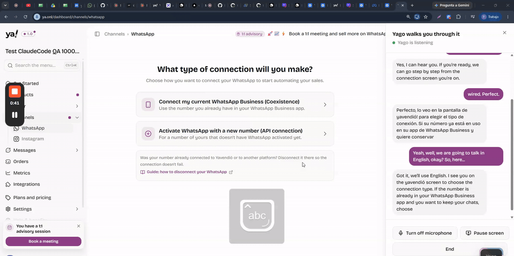
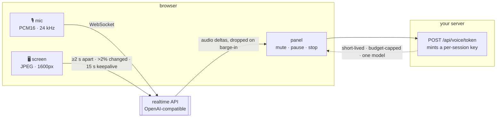

<div align="center">

# whatsapp-helper-copilot

**A voice agent that watches your screen and talks you through a setup flow, step by step.**

It sees the screen, recognizes which step the person is on, and tells them what to click next —
the way a support person on a video call would. When they start talking, it shuts up
mid-sentence.

[](LICENSE)
[](https://nextjs.org)
[](https://www.typescriptlang.org)
[](src/voice/lib/realtime-protocol.ts)

<br/>



*A real session, 25 seconds. The agent names the screen the merchant is on without being told —
then the merchant asks it to switch to English mid-session, and it switches without losing the step.*

### [**▶&nbsp; Watch the full session — 4 min**](https://drive.google.com/file/d/1zXBKJjtjKgz48NoTqvPnK3wTy48wSA8-/view)

The clip above is the first 25 seconds. The full recording runs to the part that made this worth
building: Meta answering *"the phone number you have entered is not associated with the business you
selected"*, and the agent reading that error off the screen and walking the merchant out of it.

</div>

## Quickstart

```bash
git clone https://github.com/YaVendio/whatsapp-helper-copilot.git && cd whatsapp-helper-copilot
pnpm install
cp .env.example .env      # your own key — VOICE_MODE=direct is fine locally
pnpm dev                  # → localhost:3000
```

Then: click, grant the microphone, share your **entire screen**, and talk.

Runs in the browser against any OpenAI-compatible realtime endpoint. No SDK.

## How it works



Two clicks, not one: a browser grants one permission per gesture, so the session stops between
the microphone and the screen. Full-screen shares only — setup flows open provider popups that
live outside any single tab. [Architecture →](docs/architecture.md)

## The playbook — the part you replace

The agent's knowledge is a typed structure, not a prompt string:

```ts
{
  role, scope: { allowed, refusal }, entrySteps, options[],
  finishSteps, recovery, problems: [{ signals, solution }], escalation,
  conduct?, opening
}
```

`buildSystemInstruction()` renders it at session start. Support people extend it without
touching a prompt, locales render from the same structure, and you can diff what the agent
knows between two versions.

The field that decides whether any of this works is **`signals`** — the verbatim text on the
user's screen. That is what turns *"what does the message say?"* into *"I see the credit-line
error, here is the fix"*. [How to write one →](src/playbooks/README.md)

## Adapting it

`src/voice/` has no imports from the rest of the app. Copy the directory, give the hook a
playbook, render your own panel.

```
src/voice/                     the agent — no app dependencies
  hooks/use-voice-session.ts   state machine: permissions, socket, audio, frames
  lib/                         protocol, PCM audio, frame diffing, errors, alerts
  components/                  a reference panel — replace it with yours
src/playbooks/                 the knowledge. start here when adapting it
src/app/api/voice/token/       credential minting
```

## Before you deploy this

The demo's token route is open, because the demo has no users. Yours must not be — it spends
money on every call:

1. **Authenticate the caller.** Refuse anonymous requests.
2. **Key the cooldown on that caller**, not on a shared bucket.
3. **Decide any flag or experiment arm on the server too**, and fail closed. The browser's
   assignment is not an authorization boundary.
4. **Opt the transcript out of session replay.** Speech carries whatever was on the screen
   someone was reading out loud.

`VOICE_MODE=direct` hands the key straight to the browser. It refuses to run in a production
build. It is for a laptop, not a deployment.

## Known limits

- **Safari** cannot run the floating-bubble mode we want next (Document Picture-in-Picture is
  Chrome/Edge/Firefox only). Today the panel is docked.
- **Mobile** has no screen-share equivalent. Hide the entry point there.
- **`ScriptProcessorNode` is deprecated.** An `AudioWorklet` rewrite is the obvious first
  contribution.
- The frame loop is a 1 s `setInterval`, which browsers throttle in background tabs.

## Docs

| | |
|---|---|
| [Engineering notes](docs/engineering-notes.md) | the six constraints that shaped this: permissions, barge-in, frame cost, credentials, and why nobody should say a verification code out loud |
| [Architecture](docs/architecture.md) | session lifecycle, threading model, credential flow, failure taxonomy |
| [Writing a playbook](src/playbooks/README.md) | the structure, and two rules from production |
| [Contributing](CONTRIBUTING.md) | where help is worth the most, and where it is not |
| [Full session recording](https://drive.google.com/file/d/1zXBKJjtjKgz48NoTqvPnK3wTy48wSA8-/view) | 4 minutes, unedited: the whole WhatsApp connection flow, the error Meta throws, and the recovery |

---

Why it exists: connecting WhatsApp was the highest-friction step in our onboarding — twelve
recurring failure modes that support was resolving reactively, one screenshot at a time. This
is that system, with our internal playbook swapped for a fictional one.

MIT. Built at [YaVendió](https://yavendio.com).
